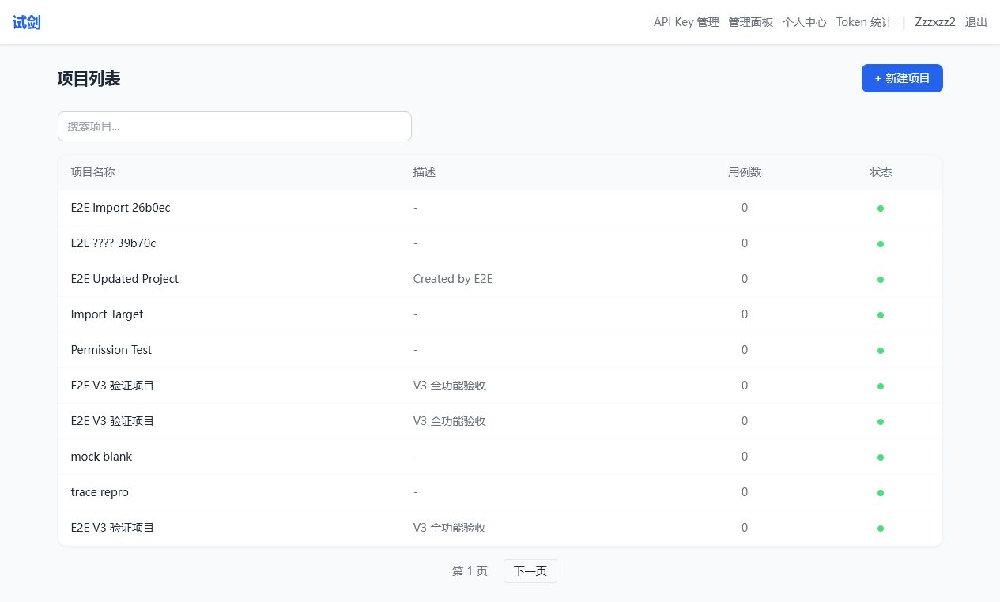
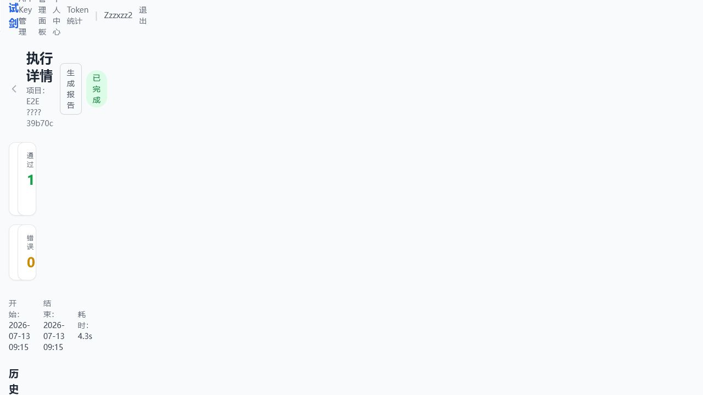

# 试剑 V3

面向个人开发者和小型团队的 API/UI 自动化测试平台。它把项目、用例、执行、报告、Mock、OpenAPI Schema、Workflow、Contract、安全用例和定时回归放在同一个 FastAPI 应用中，并提供原生 SPA 与独立 React 报告页。

> 当前定位：可复现的作品集与本地测试平台。已验证功能均列在本文中；性能压测执行器仍是预留能力，不计入完成范围。

> **版本标识：本仓库是试剑 V3，即当前可公开展示、本地部署和持续验证的作品集版本。** V1/V2 仅作为历史演进说明，不在本仓库中单独发布。

## 版本演进

以下 V1/V2 内容根据项目历史记录整理；V3 内容以当前代码、文档和自动化验收结果为准。

### V1 → V2

| 维度 | V1 | V2 |
|---|---|---|
| 后端 | 少量端点组合 | FastAPI 模块化路由、完整 CRUD、JWT/bcrypt 认证、SQLAlchemy ORM |
| 前端 | 零散页面 | 完整 SPA：Hash 路由、命名空间 JavaScript 模块、Tailwind UI |
| 测试 | 没有成体系 | API 执行引擎、httpx 请求、多类断言、Playwright 截图、WebSocket 事件流 |
| AI | 无 | DeepSeek 生成测试计划、文档上传与解析 |
| 部署 | 无 | Docker 与 Podman Compose |
| Token 统计 | 无 | `TokenUsageLog` 及多维度聚合展示 |

### V2 → V3（当前版本）

| 维度 | V2 | V3 当前实现 |
|---|---|---|
| 执行能力 | API / UI / Perf 用例模型 | API 和 UI 可执行；API 内容扩展 Workflow，Contract 通过 `schema_match` 断言实现；Mock/Schema/Security 是生成或运行时引擎。Perf 仍是占位执行器 |
| 测试集 | 无 | Suite CRUD、用例分组和一键执行 |
| 定时回归 | 无 | Cron 表达式、APScheduler 持久化调度和手动触发 |
| 历史对比 | 无 | TestRun diff：`regression` / `fixed` / `unchanged` / `new` |
| 权限 | 系统级 admin/user | 系统角色 + 项目级 owner/editor/viewer，并校验跨项目资源隔离 |
| Mock | 无 | 录制、请求匹配、回放、编辑、启停、转用例和删除 |
| LLM | 仅 DeepSeek | DeepSeek、OpenAI、Claude、Gemini、Ollama，支持 failover 链和无 Key 时的 Mock fallback |
| 即时执行 | 无 | Quick Test：自然语言生成计划、后台执行、WebSocket 事件流 |
| 失败分类 | 无 | 6 类结构化 `failure_category`：超时、连接、执行、内部、非预期状态和断言失败 |
| 覆盖率 | 无 | React + Chart.js 的 Schema/Simple 双模式仪表盘 |
| Trace 回放 | 无 | Playwright 截图和 `trace.zip`，报告页提供鉴权下载 |
| React 报告 | 无 | 独立 React 18 报告/覆盖率页，Chart.js + HashRouter，支持 `/report/{run_id}` 直访 |
| 演示靶场 | 无 | 内置 16 个路由声明，覆盖认证、任务 CRUD、上传、慢请求、管理员与错误码场景 |
| 管理员面板 | 基础能力 | 系统统计、用户管理、角色修改、强制登出和全项目列表 |
| 个人中心 | 无 | 资料修改、密码修改、通知配置预留 |
| 导入导出 | 无 | JSON 用例导入导出，支持类型/标签筛选与部分失败返回 |
| 文档 | 无统一口径 | README + 产品范围、架构、API、部署、测试、状态和安全文档 |
| CI | 无 | GitHub Actions：Python 编译/测试、Chromium 安装、React 构建、Compose 校验和三镜像构建 |
| 发布安全 | 凭据与 Git 生成物治理不完整 | 公共仓库已清理凭据/运行产物，Compose 三服务，生产 JWT/AES 密钥缺失时 fail-fast；当前仍是单实例 SQLite，不宣称分布式生产能力 |





## 已验证功能

| 能力 | 说明 |
|---|---|
| 认证与权限 | 注册、登录、JWT、访客 Token、改密、owner/editor/viewer、管理员用户管理 |
| 项目与用例 | 项目 CRUD、API/UI/Workflow/Contract 用例、批量操作、标签、导入导出 |
| 执行与报告 | 异步 TestRun、断言、历史 diff、结构化失败分类、截图、Playwright Trace |
| Mock | 录制、列表、编辑、启停、回放、转换为用例、删除 |
| Schema | OpenAPI 解析、coverage、fuzz、security、all 四种模式 |
| Workflow | 多步骤执行、变量捕获、URL/Header/Body 模板替换、失败中止 |
| Contract | JSON Schema 匹配与详细断言结果 |
| 测试集与计划 | Suite CRUD/一键执行、Cron 定时任务、手动触发、持久化调度 |
| AI 接入 | OpenAI 兼容、Claude、Gemini、Ollama provider 与 failover；无 Key 时可用 Mock provider |
| Quick Test | 自然语言生成执行计划、后台运行、WebSocket 事件流 |
| 可观测性 | Token 统计、页面分析、项目覆盖率、执行摘要与失败修复建议 |
| 演示靶场 | 自带认证、任务 CRUD、慢请求及 400/401/403/500/503 错误端点 |

## 关键场景

### API 回归

1. 创建项目并配置被测系统根地址及认证策略。
2. 创建 API 用例，定义 method、URL、headers、body 和断言。
3. 执行 TestRun，后台引擎调用目标接口并保存响应、耗时和断言结果。
4. 在报告页查看 pass/fail/error、失败分类、响应详情及历史差异。

### Workflow 与 Contract

1. 登录步骤捕获 `access_token`。
2. 创建资源并捕获资源 ID。
3. 后续步骤在 URL、Header 或 Body 中引用 `{{variable}}`。
4. 使用 `schema_match` 验证返回结构；任一步失败时停止后续步骤。

### Mock 录制回放

1. 开启项目录制模式。
2. 正常执行 API 用例，记录请求与响应。
3. 编辑、启停或将记录转换为正式用例。
4. 切换 replay 模式，在目标服务不可用时返回已录制响应。

### UI 与 Trace

1. 用 UI steps 描述 navigate、click、type、assert 和 screenshot。
2. Playwright 子进程执行浏览器动作。
3. 保存步骤截图和 `trace.zip`，在报告中下载复盘。

### OpenAPI 驱动

1. 提交 OpenAPI JSON。
2. coverage 模式补齐基础端点用例；fuzz 模式生成边界值；security 模式生成攻击向量。
3. 保存生成的 stub，并纳入 Suite 或定时回归。

## 技术栈

- 后端：Python 3.12、FastAPI、SQLAlchemy 2、SQLite/aiosqlite、APScheduler
- 执行：httpx、Playwright、jsonschema
- 前端：原生 JavaScript SPA；React 18 + Vite + Chart.js 报告页
- 安全：bcrypt、JWT、AES-256-GCM、显式 CORS allowlist
- 部署：Docker/Podman Compose、Nginx、持久化 volume

## 本地启动

```powershell
python -m venv .venv
.\.venv\Scripts\Activate.ps1
pip install -r requirements-dev.txt
playwright install chromium

cd backend
python -m uvicorn main:app --host 127.0.0.1 --port 8000
```

另开终端启动演示靶场：

```powershell
cd target-system
python -m uvicorn main:app --host 127.0.0.1 --port 8003
```

另开终端启动 React 报告页：

```powershell
cd frontend\react-app
npm ci
npm run dev -- --host 127.0.0.1 --port 5173
```

访问：

- 主 SPA：<http://127.0.0.1:8000/app.html>
- OpenAPI：<http://127.0.0.1:8000/docs>
- React 报告：<http://127.0.0.1:5173>
- 演示靶场：<http://127.0.0.1:8003>

全新数据库注册的第一个用户自动成为管理员。仓库不包含任何生产账号或密码。

## 容器部署

```powershell
Copy-Item .env.example .env
python -c "import secrets; print(secrets.token_urlsafe(48))"
python -c "import secrets; print(secrets.token_hex(32))"
# 将输出分别写入 .env 的 JWT_SECRET 和 API_KEY_ENCRYPTION_KEY
docker compose up --build -d
docker compose ps
```

Compose 启动主系统 8000、React 报告 5173 和演示靶场 8003。生产部署、反向代理和备份见 [部署文档](docs/DEPLOYMENT.md)。

## 测试

```powershell
# 后端模块测试（不需要外部服务）
python -m pytest -q --ignore=tests/e2e

# React 构建
cd frontend\react-app
npm ci
npm run build:spa-css
npm run build

# 自包含 E2E：先启动 8000 与 8003
cd ..\..
python run_e2e.py

# 扩展回归
$env:BACKEND='http://127.0.0.1:8000'
python tests/e2e_regression.py
```

测试分层和当前验证结果见 [TESTING.md](docs/TESTING.md)。

## 安全说明

- `.env`、数据库、日志、上传文件、截图、MCP 本机配置和依赖目录均被 Git/Docker 排除。
- `ENV=production` 时必须提供 JWT secret 和 32 字节 AES Key，否则应用明确拒绝相关不安全配置。
- 旧开发目录中曾出现过 QQ SMTP 授权码；该授权已由所有者撤销。本公共目录从未包含该值。
- 邮件功能默认关闭。需要时只在本地或部署环境的 `.env` 中设置 `QQ_*` 变量，严禁提交授权码。
- 演示靶场故意包含可测试的错误与安全场景；Compose 默认只绑定 `127.0.0.1:8003`，不得改为公网监听。
- 原生 SPA 使用仓库内生成的 `frontend/assets/tailwind.css`，不在运行时加载第三方 CSS 脚本。

详见 [SECURITY.md](SECURITY.md)。

## 项目边界

- SQLite 和单进程后台任务适合个人、小团队与作品演示；多实例部署应迁移 PostgreSQL 和独立任务队列。
- Security/Fuzz 模块生成并执行测试输入，但不等价于专业漏洞扫描器。
- Perf executor 尚未实现，因此不宣传性能压测能力。
- 邮件和第三方 LLM 需要用户自己的凭据；测试默认使用关闭邮件和 Mock LLM。

## 文档

- [产品范围](docs/PRD.md)
- [架构](docs/ARCHITECTURE.md)
- [API](docs/API.md)
- [部署](docs/DEPLOYMENT.md)
- [测试](docs/TESTING.md)
- [当前状态](docs/STATUS.md)
- [贡献指南](CONTRIBUTING.md)

## 许可证

本仓库用于作品展示与技术评估，默认保留全部权利，见 [LICENSE](LICENSE)。如计划开放复用，可由版权所有者另行切换为 MIT 或 Apache-2.0。
